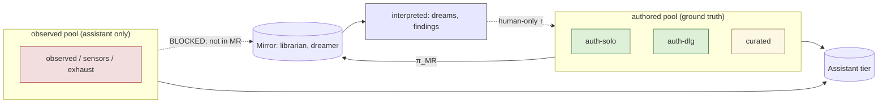
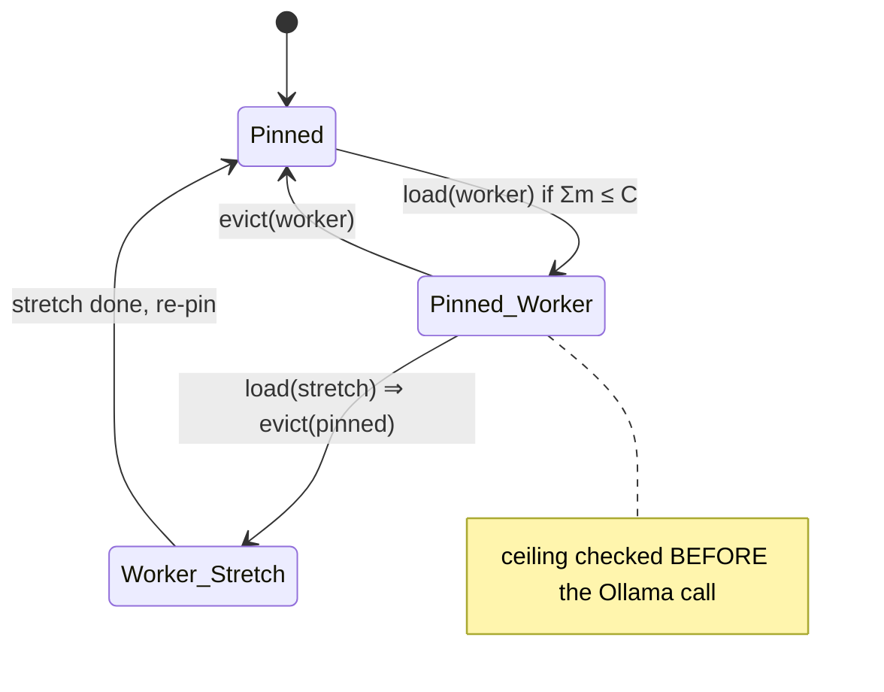
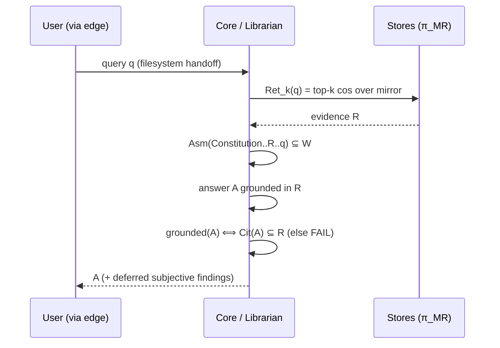
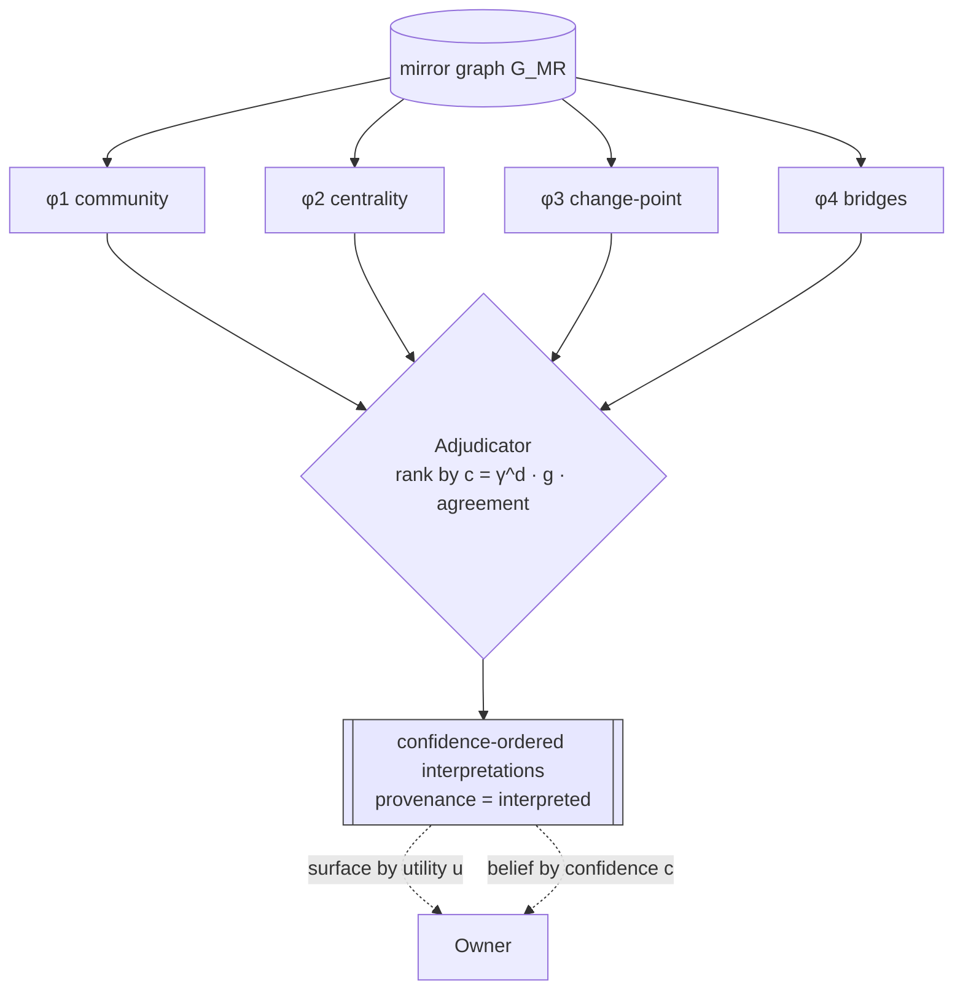
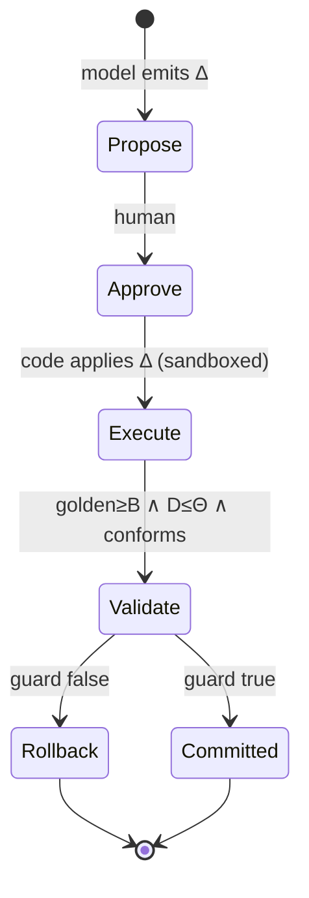

# The Mind Palace — Formal Models & Figures
### Technical companion to `WHITEPAPER.md` (v1.0, 2026-06-26)

This companion formalizes the design: it maps each philosophical commitment to the **sets,
operators, and predicates** that realize it, with figures per subsystem. Section numbers track
the white paper.

**On rigor (read this).** Most formalizations below are *precise invariants or operation
definitions* the implementation must enforce — they are specifications, not proofs, and they are
only as strong as their (structural where possible) enforcement. Exactly one item, the
recursion-decay in §8, is an **illustrative analogy** to a contraction mapping: it names the
*property the design imposes*, not a convergence theorem about the running system. It is labeled
where it appears.

---

## Notation

| symbol | meaning |
|---|---|
| $\mathcal{B}^*$ | byte strings (raw inputs); $V$ = set of corpus nodes (notes/chunks) |
| $H:\mathcal{B}^*\to\Sigma$ | content-address (SHA-256) into digest space $\Sigma$ |
| $e:V\to\mathbb{R}^{n}$, $n{=}2560$ | embedding; $\cos(u,v)=\tfrac{u\cdot v}{\lVert u\rVert\lVert v\rVert}$ |
| $G=(V,E)$ | thought-graph; $E = E_{\text{auth}}\cup E_{\text{sim}}$ (authored links ∪ similarity edges) |
| $P$, $\rho:V\to P$ | provenance classes; provenance-labeling of every node |
| $\mathsf{MR}\subseteq P$ | mirror-readable classes; $\pi_{\mathsf{MR}}(V)=\{v:\rho(v)\in\mathsf{MR}\}$ |
| $R$, $m$, $C$ | resident model set; memory map $m:\text{models}\to\mathbb{R}_{\ge0}$; ceiling $C\approx24$ GB |
| $\tau$, $W$, $h$ | token-cost map; context window; reply headroom |
| $\mathrm{Ret}_k(q)$, $\mathrm{Cit}(A)$ | top-$k$ retrieved set for query $q$; citation set of answer $A$ |
| $\varphi_i$, $\kappa$, $\mathrm{supp}(\kappa)$ | interpreter $i$; a claim; its supporting node set $\subseteq V$ |
| $g,u,c,d$ | grounding score, utility, confidence, derivation depth of a claim |
| $B$, $s_t$, $D(t)$, $\Theta$ | frozen baseline; state at $t$; drift; tolerance |
| $\mathcal{A}(\cdot)$ | authority = the set of capability handles an agent holds |

---

## 1. Corpus, graph, embedding space

**Principle:** *raw is sacred; derived is regenerable.*

Ingestion is a content-addressed, injective-by-collision-resistance store
$$H:\mathcal{B}^*\to\Sigma,\qquad \text{store}(b)=\big(H(b),\,b\big)\ \text{written once, never mutated.}$$
The derived layer is a family of **pure functions of the raw**: $\text{chunk}, e=\text{embed}$, so
re-embedding under a new model $e'$ is recomputation $e'(\text{chunk}(b))$, never information loss.
The graph is $G=(V,E)$ with $E_{\text{sim}}=\{(u,v):\cos(e(u),e(v))\ge\sigma\}$.

```
        bytes b ──H──► (digest, verbatim bytes)        [RAW: immutable, content-addressed]
                           │
                           ├─ chunk ─► c1..ck
                           └─ e(·)   ─► vectors          [DERIVED: regenerable; reset+rebuild from raw]
                                        │
                                        └─ E_sim (cos ≥ σ) ∪ E_auth  ─►  G=(V,E)   [THOUGHT-GRAPH]
```

---

## 2. Provenance & the firewall

**Principle:** *mirror, not oracle; observed never contaminates the authored mirror.*

Provenance is a labeling $\rho:V\to P$ with $P=\{\textsf{auth-solo},\textsf{auth-dlg},\textsf{curated},\textsf{observed},\textsf{interpreted}\}$. The load-bearing structure is the **mirror-readable set** $\mathsf{MR}=\{\textsf{auth-solo},\textsf{auth-dlg}\}$ — membership, not a trust order. (Earlier drafts posited a trust preorder $\preceq$; gap G8 retired it as decorative — nothing orders the classes, and $\textsf{interpreted}$ is a *derived* axis orthogonal to trust, so a single order would be fiction. What is load-bearing — and now structural — is $\mathsf{MR}$-membership via the typed `MirrorView` and the derivation-invariance of $\rho$ via a `DerivedStore` with no provenance parameter. A richer order is deferred until classes that need ordering exist.)

**Firewall invariant.** Every introspective operation $\Omega$ (librarian over the mirror, dreamer) takes input only from the projection:
$$\mathrm{in}(\Omega)\subseteq\pi_{\mathsf{MR}}(V).$$
Since $\textsf{observed}\notin\mathsf{MR}$, observed exhaust is *unreachable* to $\Omega$ — not "filtered after the fact," but never in the input set.

**Unforgeability of inference.** The derived store's insert has codomain pinned: $\text{add}(x)\Rightarrow\rho(x)=\textsf{interpreted}$ (no provenance parameter exists). Promotion is a partial, **human-only** map $\uparrow:\,V\rightharpoonup V$ that relabels; no automatic relabeling exists.



---

## 3. Resource model (two slots)

**Principle:** *scale in agents, not models; respect the ceiling structurally.*

State $R$ with $|R|\le 2$, $R=\{\textsf{pinned}\}\cup(\{\textsf{worker}\}\ \text{or}\ \varnothing)$. **Invariant**
$$\sum_{x\in R} m(x)\;\le\;C.$$
$\mathrm{load}(x)$ is a **guarded transition**: the predicate $\sum_{x'\in R'}m(x')\le C$ is checked *before* the side effect (the actual built behavior — it refuses a breaching load prior to any model call). $\textsf{stretch}$ tier forces $R'\setminus\{\textsf{pinned}\}$ (eviction).



---

## 4. Context assembly (priority truncation)

**Principle:** *the Constitution is the immutable outermost frame; fit the window.*

Given ordered frames $F=\langle f_1=\textsf{Constitution}, f_2=\textsf{role/skills}, f_3=\textsf{evidence}, f_4=\textsf{history}, f_5=\textsf{query}\rangle$ and budget $W$, the assembly operator $\mathsf{Asm}$ returns $F'$ with $f_1$ **pinned** and the rest trimmed lowest-priority-first until
$$\sum_{f\in F'}\tau(f)\;\le\;W-h.$$
Trim order: shrink $\textsf{evidence}$ top-$k$ → compact $\textsf{history}$ → truncate tool outputs; **never $f_1$**. (Window $W$ is a per-role *load-time* choice — `num_ctx` — so jobs are batched by $W$ to avoid reload.)

```
   ┌─ Constitution ─┐  pinned (hard)         trim priority (low→high):
   │  role / skills │                          evidence  ▸  history  ▸  tool-output
   │   evidence     │  ◄── trimmed first         (Constitution never trimmed)
   │   history      │
   │   query        │  must fit: Στ ≤ W − h
   └────────────────┘
```

---

## 5. Retrieval & grounding

**Principle:** *a cited identifier that does not resolve is a failure.*

Retrieval: $\mathrm{Ret}_k(q)=\operatorname{top-}k_{v\in\pi_{\mathsf{MR}}(V)}\cos(e(q),e(v))$.
**Grounding predicate** on answer $A$ over retrieved $R{=}\mathrm{Ret}_k(q)$:
$$\textsf{grounded}(A)\iff \mathrm{Cit}(A)\subseteq R,\qquad \Phi(A)=\mathrm{Cit}(A)\setminus R,\qquad \textsf{FAIL}\iff\Phi(A)\neq\varnothing.$$
The self-check $=$ this **deterministic predicate (always-on)** $\;\sqcup\;$ a deferred subjective judge $J$ (mirror-not-oracle, calibration, deference), where $J$ is *never* scored cold — it is `deferred` until A/B-against-baseline exists.



---

## 6 / 8. The dream / interpretation engine

**Principle:** *interpretation is hypothesis; tame the recursion; evidence decides, not persuasion.*

**Interpreters** (method-specialists) are maps over the mirror graph:
$$\varphi_i:\;G_{\mathsf{MR}}\;\longrightarrow\;2^{\mathcal{K}},\qquad \kappa=(\text{statement},\ \mathrm{supp}(\kappa)\subseteq V),$$
with $\varphi_i\in\{$Leiden community, centrality, change-point, bridge/structural-hole, density$\}$ — mostly model-free. **Grounding score** $g(\kappa)\in[0,1]$ measures how well $\mathrm{supp}(\kappa)$ resolves in *authored* nodes.

**Adjudication, not voting.** Cross-interpreter agreement is a *confidence multiplier*, not a decider. With agreement set $\mathrm{Agr}(\kappa)=\{i:\kappa\in\varphi_i(G)\}$,
$$c_0(\kappa)=g(\kappa)\cdot\big(1+\lambda(|\mathrm{Agr}(\kappa)|-1)\big),$$
and the adjudicator outputs claims **ordered by $c$**, ranking on grounding-weighted evidence — never on rhetorical quality.

**Recursion as a contraction *(illustrative analogy — a design constraint, not a theorem)*.** Let the **derivation DAG** carry an edge $\kappa'\!\to\!\kappa$ when $\kappa'$ is scaffolding for $\kappa$. Define $d(\kappa)=$ longest path from $\kappa$ to an **authored leaf**. The design *imposes*
$$c(\kappa)\;\le\;\gamma^{\,d(\kappa)}\,g(\kappa),\qquad \gamma\in(0,1).$$
Because $\gamma<1$, confidence **strictly decays** with derivational distance from ground truth: depth is a discount, so a self-referential loop loses potency every pass instead of amplifying — the formal shape of *taming the stack-overflow of a mind thinking only about itself*. **Hard constraint accompanying it:** every leaf of the support-closure is authored ($d$ is finite; chains may not close inside $\textsf{interpreted}$).

**Two axes, never collapsed.** Utility $u(\kappa)$ (did surfacing it help) and confidence $c(\kappa)$ (is it grounded) are distinct maps. Surfacing rank uses $u$; belief rank uses $c$. A single combined scalar is forbidden (it selects pleasing-over-true).



```
derivation DAG + decay:    authored leaves          d=0   c ≤ g
                              │   │   │
                             κ_a κ_b κ_c             d=1   c ≤ γ·g
                                │   │
                               κ_ab (2nd-order)      d=2   c ≤ γ²·g
                                  │
                               κ_abx (3rd-order)     d=3   c ≤ γ³·g   ← potency degrades in rank
```

---

## 7 / 9. Drift, baselines, and why a *frozen* anchor is necessary

**Principle:** *some drift is fine; deterioration is not — measure it, don't assume it.*

Let $\mu(s)$ be the measured profile (golden-set metrics ⊕ conformance vector), $B=\mu(s_0)$ the **frozen** anchor. Drift $D(t)=d\big(\mu(s_t),B\big)$; alarm/rollback when $D(t)>\Theta$.

**The boiling-frog inequality (this is a real statement, not analogy).** With a *rolling* baseline $B_t^{\text{roll}}=\mu(s_{t-1})$ and step drift $\delta_t=d(\mu(s_t),\mu(s_{t-1}))$, bounding each step does **not** bound the total:
$$\big(\forall t,\ \delta_t\le\theta\big)\;\not\Rightarrow\;D(T)\le\theta,\qquad\text{since by the triangle inequality}\quad D(T)\le\textstyle\sum_{t\le T}\delta_t,$$
and the bound $\sum\delta_t$ grows without limit. Therefore only $D(t)$ measured against a **fixed** $B$ bounds cumulative displacement — the formal reason the golden set and Constitution must be frozen, human-blessed anchors.

```
metric vs time:
  μ(s_t) ───●───●───●───●───●───●──►        each step δ_t ≤ θ  (rolling: "all clear")
            └───────── D(t)=d(μ(s_t),B) ─────►   cumulative vs FROZEN B can exceed Θ → ALARM
  B (frozen) ━━━━━━━━━━━━━━━━━━━━━━━━━━━━━━━━     the only honest reference line
```

---

## §self-mod. The gate as a guarded transition system

**Principle:** *propose → approve → execute → validate → roll back; the model advises, code acts.*

State $s$, model-emitted change $\Delta$. The gate guard
$$G(\Delta,s)\;=\;\textsf{approved}(\Delta)\ \wedge\ \text{golden}(\Delta\!\cdot\!s)\ge\text{golden}(B)\ \wedge\ D(\Delta\!\cdot\!s)\le\Theta\ \wedge\ \textsf{conforms}(\Delta\!\cdot\!s),$$
$$s' \;=\; \begin{cases}\Delta\!\cdot\!s & \text{if } G(\Delta,s)\\[2pt] s & \text{otherwise (rollback)}\end{cases}$$
where $\Delta\!\cdot\!s$ denotes **code** applying $\Delta$ (never the model). All hard invariants are preserved because (i) $\Delta$ never self-executes, (ii) acceptance requires non-regression against *both* fixed points, (iii) rejection is identity.



---

## §scope. Object-capability (authority as a set, monotone non-widening)

**Principle:** *a tool is a handle you hold, not a flag you are granted.*

Authority $\mathcal{A}(\text{agent})=$ the set of capability handles it holds; there is **no ambient authority** (reachable $=$ held). Minting resolves
$$\mathcal{A}\big(\mathrm{mint}(\text{role},\text{task})\big)=\mathrm{scope}(\text{role})\cap\textsf{MAX}.$$
Skills add **context, not handles**: for any skill $\varsigma$, $\ \mathcal{A}(\text{agent}\oplus\varsigma)=\mathcal{A}(\text{agent})$ (**non-widening**). Hence for out-of-scope tool $t\notin\mathcal{A}(\text{agent})$, invocation is *unreachable* (absent from the dispatch table), not "checked then refused." This is the formal content of "knows about deploying, cannot do it."

---

## Synthesis — philosophy ⟶ operation ⟶ enforcement

| Philosophy (the *why*) | Formal operation (the *what*) | Enforcement (the *where*) |
|---|---|---|
| Raw is sacred | $H$ content-address, derived $=f(\text{raw})$ | immutable raw store; reset+rebuild |
| Mirror, not oracle / firewall | $\mathrm{in}(\Omega)\subseteq\pi_{\mathsf{MR}}(V)$; $\rho\!\equiv\!\textsf{interpreted}$ on insert | provenance-prefiltered reads; derived store has no provenance arg |
| Respect the ceiling | $\sum_{R}m\le C$, $|R|\le2$ guarded | check-before-load in `TwoSlotLoader` |
| Constitution outermost | $\mathsf{Asm}$ pins $f_1$; trim others | frame composer + budgeter |
| No fabrication | $\textsf{grounded}(A)\iff\mathrm{Cit}(A)\subseteq R$ | deterministic self-check |
| Tame recursion | $c\le\gamma^{d}g$; authored leaves only | depth tag + decay + grounding-terminates-authored |
| Evidence, not persuasion | rank by $c$; agreement = multiplier | adjudicator (not voting) |
| Belief ≠ usefulness | distinct $c,u$; no single scalar | separate ranking axes |
| Deterioration ≠ drift | $D(t)=d(\mu(s_t),B)>\Theta\Rightarrow$ alarm | frozen anchors + drift gauge |
| Model advises, code acts | $s'=\Delta\!\cdot\!s$ iff $G(\Delta,s)$, code applies | gated transition + rollback |
| Capability is a handle | $\mathcal{A}(\text{agent}\oplus\varsigma)=\mathcal{A}(\text{agent})$ | object-capability dispatch table |

The thesis of this companion: **each line of philosophy compiles to an invariant or an operator, and each invariant has a structural enforcement point.** That compilation — reasoning ⟶ formal operation ⟶ code that makes the wrong thing unreachable — is what makes the system trustworthy rather than merely well-intentioned.
